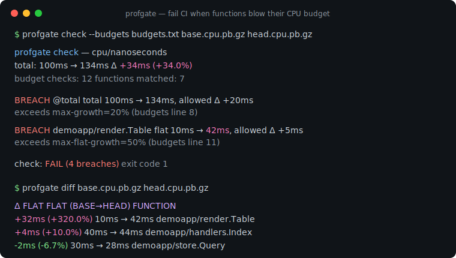
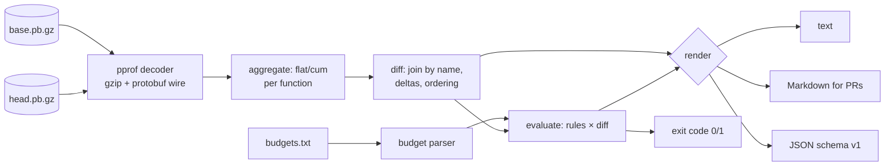

# profgate

[English](README.md) | [中文](README.zh.md) | [日本語](README.ja.md)

[](LICENSE) [](go.mod) [](CHANGELOG.md)  [](CONTRIBUTING.md)

**profgate：pprof プロファイルを差分比較し、関数が CPU やアロケーションの予算を超えたら CI を落とすオープンソース・ゼロ依存 CLI——ヘッドレス、しきい値駆動、PR にそのまま貼れる Markdown 付き。**



```bash
git clone https://github.com/JaydenCJ/profgate && cd profgate
go build -o profgate ./cmd/profgate    # single static binary, stdlib only
```

> プレリリース：v0.1.0 はまだどのレジストリにもタグ付けされていません。上記の通りソースからビルドしてください（Go ≥1.22 なら可）。

## なぜ profgate？

Go のチームはすでに pprof プロファイルを集めています——`go test -cpuprofile`、`/debug/pprof` のスナップショット、ベンチマーク成果物——それなのに、見るのはインシデントの後だけ。間を埋めるツールがループを閉じてくれないのです：`go tool pprof -diff_base` は対話プロンプトの前にいる人間向けで、しきい値の概念がなく、常に 0 で終了するため CI が反応できる材料がありません。`benchstat` はベンチマークの所要時間を比べますが、*どの関数*が悪化したか、アロケーションがどこへ行ったかは語りません。継続的プロファイリング SaaS は全部答えてくれますが、実費がかかり、プロファイルを外部へ送ることになります。profgate は欠けていたゲートそのもの：内蔵の protobuf デコーダ（依存ゼロ）で 2 つの pprof ファイルを解析し、関数ごとに突き合わせ、コードの隣にコミットした予算ファイル——絶対上限、増加上限、総量比、プロファイル全体の上限——を評価して、関数名・数値・破られたルールを明記した Markdown レポートとともに終了コード 1 を返すヘッドレスバイナリです。

| | profgate | go tool pprof -diff_base | benchstat | プロファイリング SaaS |
|---|---|---|---|---|
| ヘッドレス・CI ファースト（意味のある終了コード） | ✅ | ❌ 対話式 | ✅ | ❌ ダッシュボード |
| 関数単位の予算（絶対値 + 増加） | ✅ | ❌ | ❌ | ⚠️ アラートのみ |
| PR にそのまま貼れる Markdown レポート | ✅ | ❌ | ❌ | ❌ |
| 関数レベルの帰属（flat/cum） | ✅ | ✅ | ❌ 時間のみ | ✅ |
| ヒーププロファイル対応（バイト予算） | ✅ | ✅ | ❌ | ✅ |
| オフライン動作、プロファイルは runner の外に出ない | ✅ | ✅ | ✅ | ❌ |
| ランタイム依存 | 0 | Go ツールチェーン | Go ツールチェーン | agent + バックエンド |

<sub>依存数は 2026-07-13 に確認：profgate は Go 標準ライブラリしか import しません——profile.proto のワイヤ復号までリポジトリ内製なので、`go build` にはコンパイラ以外何も要りません。</sub>

## 特徴

- **本物の pprof、依存ゼロ** — profile.proto 用の最小 protobuf ワイヤデコーダを同梱：gzip でも生でも、packed でも非 packed でも読め、未知フィールドはスキップし、壊れたファイルは panic ではなく正確なエラーで拒否します。
- **予算をコードとして管理** — 行ベースの `budgets.txt`、パターンはアンカー付き glob：`max-flat`、`max-cum`、増加上限、`@total` の全体上限；値は `25ms`、`4MiB`、`10%`、生カウントで書け、プロファイルの単位と照合されます。
- **本物の回帰を捕まえる増加セマンティクス** — 増加率は base 基準なので、新登場のホットな関数はどんなパーセント上限も突破扱い；改善が失敗になることはなく、`max-flat-growth=0ns` で一切の増加を封じられます。
- **PR 向け Markdown** — `--format markdown` は判定を先頭に、違反テーブル（関数、base→head、Δ、ルールとその行番号）、続いて変動上位を出力；PR コメントやジョブサマリーへそのままパイプできます。
- **任意の sample type** — CPU ナノ秒、`alloc_space` バイト、`alloc_objects` カウント、その他プロファイル内の型を `--sample-type` で指定；ナノ秒とバイトの比較はハードエラーで、ゴミ diff は決して出しません。
- **バイト単位まで決定的** — 同一入力からは並び順も含めて同一のレポート；機械向けには安定した JSON（`schema_version: 1`）。
- **CI 級の終了コード** — 0 合格、1 予算違反、2 フラグ/予算の誤り、3 プロファイル読取不能——パイプラインが「回帰」と「profgate の設定ミス」を区別できます。

## クイックスタート

```bash
# fabricate a demo base/head pair (or use your own pprof files)
go run ./examples/make-demo-profiles /tmp/demo
./profgate diff /tmp/demo/base.cpu.pb.gz /tmp/demo/head.cpu.pb.gz
```

実際に取得した出力：

```text
profgate diff — cpu/nanoseconds
base: /tmp/demo/base.cpu.pb.gz   head: /tmp/demo/head.cpu.pb.gz
total: 100ms → 134ms   Δ +34ms (+34.0%)

Δ FLAT               FLAT (BASE→HEAD)     Δ CUM                CUM (BASE→HEAD)      FUNCTION
+32ms (+320.0%)      10ms → 42ms          +32ms (+320.0%)      10ms → 42ms          demoapp/render.Table
+4ms (+10.0%)        40ms → 44ms          +4ms (+6.7%)         60ms → 64ms          demoapp/handlers.Index
-2ms (-6.7%)         30ms → 28ms          -2ms (-6.7%)         30ms → 28ms          demoapp/store.Query
0 (0.0%)             0 → 0                +34ms (+34.0%)       100ms → 134ms        demoapp/router.Serve
0 (0.0%)             0 → 0                +34ms (+34.0%)       100ms → 134ms        main.main
0 (0.0%)             0 → 0                +30ms (+75.0%)       40ms → 70ms          demoapp/handlers.Report
… 1 more function; use --top 0 --all to list every one
```

次にゲートを掛けます——`./profgate check --budgets examples/budgets.txt /tmp/demo/base.cpu.pb.gz /tmp/demo/head.cpu.pb.gz`（実際の出力、終了コード 1）：

```text
profgate check — cpu/nanoseconds
total: 100ms → 134ms   Δ +34ms (+34.0%)
budget checks: 12   functions matched: 7

BREACH  @total                           total  100ms → 134ms, allowed Δ +20ms  exceeds max-growth=20% (budgets line 8)
BREACH  demoapp/render.Table             flat   10ms → 42ms, allowed 35ms  exceeds max-flat=35ms (budgets line 11)
BREACH  demoapp/render.Table             flat   10ms → 42ms, allowed Δ +5ms  exceeds max-flat-growth=50% (budgets line 11)
BREACH  demoapp/render.Table             flat   10ms → 42ms, allowed Δ +20ms  exceeds max-flat-growth=200% (budgets line 20)

check: FAIL (4 breaches)
```

同じ実行に `--format markdown` を付ければ、そのまま PR コメントになります（抜粋）：

```text
## profgate check — ❌ FAIL

| Function | Metric | Base | Head | Δ | Budget | Rule |
|---|---|---:|---:|---:|---|---|
| `demoapp/render.Table` | flat | 10ms | 42ms | **+32ms (+320.0%)** | `max-flat-growth=50%` | budgets line 11 |
```

## 予算

ルールはコミットされたテキストファイル（1 行 = パターン + 制限）またはインラインの `--budget` フラグで書きます——完全なリファレンスは [docs/budgets.md](docs/budgets.md)、注釈付きの例は [examples/budgets.txt](examples/budgets.txt) へ。

| キー | 適用対象 | 違反条件 |
|---|---|---|
| `max-flat` / `max-cum` | 関数 glob | head の値が上限を超える |
| `max-flat-growth` / `max-cum-growth` | 関数 glob | head − base が許容量を超える |
| `max` / `max-growth` | `@total` | プロファイル総量 / その増加が上限を超える |

値：CPU プロファイルには時間（`250ns`…`1.5s`）、ヒーププロファイルにはサイズ（`512B`、`4KiB`、`2MiB`）、`%`（値制限は head 総量比、増加制限は base 比）、または生カウント。プロファイルと合わない単位は設定エラーで終了コード 2 です。

## CLI リファレンス

`profgate <diff|check|show|version> [flags] <profiles…>` — 終了コード：0 合格、1 違反、2 用法/設定エラー、3 ランタイムエラー。

| フラグ | 既定値 | 効果 |
|---|---|---|
| `--format` | `text` | `text`、`markdown`、`json`（`show`：`text`/`json`） |
| `--sample-type` | プロファイルの既定 | 例：`cpu`、`alloc_space`、限定形 `cpu/nanoseconds` |
| `--top` | 20（`check`：10） | 表の行数を制限；`0` = 無制限 |
| `--all` | オフ | 値が変わらなかった関数も表示する |
| `--budgets`（check） | — | 予算ファイルのパス |
| `--budget`（check） | — | インラインルール `'PATTERN key=value …'`、繰り返し可 |

## 検証

このリポジトリは CI を同梱しません。上記の主張はすべてローカル実行で検証します：

```bash
go test ./...            # 90 deterministic tests, offline, < 5 s
bash scripts/smoke.sh    # end-to-end CLI check, prints SMOKE OK
```

## アーキテクチャ



## ロードマップ

- [x] v0.1.0 — 標準ライブラリのみの pprof デコーダ、任意 sample type の flat/cum 差分、増加セマンティクス付き glob 予算、text/Markdown/JSON レポート、`check` 終了コードゲート、90 テスト + smoke スクリプト
- [ ] `--baseline-dir` モード：日付別プロファイルのディレクトリから最新のベースラインを選択
- [ ] 違反関数へのソース行注記（`file.go:42`）
- [ ] 1 回の実行で複数プロファイルを検査（CPU + ヒープを同時にゲート）
- [ ] 任意のノイズ下限：N サンプル未満の差分を無視してサンプリング揺れを吸収
- [ ] `profgate init`：現在のプロファイルの上位関数から予算ファイルの雛形を生成

全リストは [open issues](https://github.com/JaydenCJ/profgate/issues) を参照してください。

## コントリビュート

Issue・議論・PR を歓迎します——ローカルの手順（フォーマット、vet、テスト、`SMOKE OK`）は [CONTRIBUTING.md](CONTRIBUTING.md) へ。入門向けタスクは [good first issue](https://github.com/JaydenCJ/profgate/issues?q=is%3Aissue+is%3Aopen+label%3A%22good+first+issue%22) のラベル付き、設計の話題は [Discussions](https://github.com/JaydenCJ/profgate/discussions) にあります。

## ライセンス

[MIT](LICENSE)
