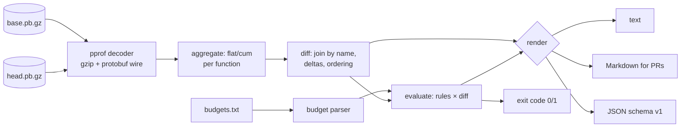

# profgate

[English](README.md) | [中文](README.zh.md) | [日本語](README.ja.md)

[](LICENSE) [](go.mod) [](CHANGELOG.md)  [](CONTRIBUTING.md)

**profgate：an open-source, zero-dependency CLI that diffs pprof profiles and fails CI when functions exceed CPU or allocation budgets — headless, thresholded, and PR-ready Markdown out of the box.**


```bash
git clone https://github.com/JaydenCJ/profgate && cd profgate
go build -o profgate ./cmd/profgate    # single static binary, stdlib only
```

> Pre-release: v0.1.0 is not tagged on a package registry yet; build from source as above (any Go ≥1.22).

## Why profgate?

Go teams already collect pprof profiles — `go test -cpuprofile`, `/debug/pprof` snapshots, benchmark artifacts — and then only look at them after an incident. The tools in between don't close the loop: `go tool pprof -diff_base` is built for a human at an interactive prompt, has no notion of a threshold, and always exits 0, so there is nothing for CI to act on; `benchstat` compares benchmark timings but says nothing about *which function* regressed or where allocations went; continuous-profiling SaaS answers all of this but costs real money and ships your profiles off-box. profgate is the missing gate: a headless binary that parses two pprof files with an in-tree protobuf decoder (zero dependencies), joins them per function, evaluates the budgets file your team commits next to the code — absolute caps, growth caps, percent-of-total, whole-profile limits — and exits 1 with a Markdown report that names the function, the numbers, and the exact rule it broke.

| | profgate | go tool pprof -diff_base | benchstat | profiling SaaS |
|---|---|---|---|---|
| Headless, CI-first (meaningful exit codes) | ✅ | ❌ interactive | ✅ | ❌ dashboard |
| Per-function budgets (absolute + growth) | ✅ | ❌ | ❌ | ⚠️ alerting only |
| PR-ready Markdown report | ✅ | ❌ | ❌ | ❌ |
| Function-level attribution (flat/cum) | ✅ | ✅ | ❌ timings only | ✅ |
| Works on heap profiles (bytes budgets) | ✅ | ✅ | ❌ | ✅ |
| Offline, profiles never leave the runner | ✅ | ✅ | ✅ | ❌ |
| Runtime dependencies | 0 | Go toolchain | Go toolchain | agent + backend |

<sub>Dependency counts checked 2026-07-13: profgate imports the Go standard library only — even the profile.proto wire decoding is in-tree, so `go build` needs nothing beyond the compiler.</sub>

## Features

- **Real pprof, zero dependencies** — a minimal protobuf wire decoder for profile.proto lives in-tree: gzip or raw, packed or unpacked encodings, unknown fields skipped, corrupt files rejected with precise errors instead of panics.
- **Budgets as code** — a line-based `budgets.txt` with anchored globs: `max-flat`, `max-cum`, growth caps, `@total` whole-profile limits; amounts in `25ms`, `4MiB`, `10%`, or raw counts, unit-checked against the profile.
- **Growth semantics that catch real regressions** — percent growth is relative to base, so a brand-new hot function breaches any percent cap; improvements never fail; `max-flat-growth=0ns` blocks any creep at all.
- **PR-ready Markdown** — `--format markdown` leads with the verdict and a breach table (function, base→head, Δ, the rule and its line number), then top movers; pipe it straight into a PR comment or job summary.
- **Any sample type** — CPU nanoseconds, `alloc_space` bytes, `alloc_objects` counts, or anything else in the profile via `--sample-type`; comparing nanoseconds against bytes is a hard error, never a garbage diff.
- **Deterministic to the byte** — identical inputs produce identical reports, orderings included; stable JSON (`schema_version: 1`) for machines.
- **CI-grade exit codes** — 0 ok, 1 budget breached, 2 bad flags/budgets, 3 unreadable profile — so the pipeline can tell "regression" from "profgate misconfigured".

## Quickstart

```bash
# fabricate a demo base/head pair (or use your own pprof files)
go run ./examples/make-demo-profiles /tmp/demo
./profgate diff /tmp/demo/base.cpu.pb.gz /tmp/demo/head.cpu.pb.gz
```

Real captured output:

```text
profgate diff — cpu/nanoseconds
base: /tmp/demo/base.cpu.pb.gz   head: /tmp/demo/head.cpu.pb.gz
total: 100ms → 134ms   Δ +34ms (+34.0%)

Δ FLAT               FLAT (BASE→HEAD)     Δ CUM                CUM (BASE→HEAD)      FUNCTION
+32ms (+320.0%)      10ms → 42ms          +32ms (+320.0%)      10ms → 42ms          demoapp/render.Table
+4ms (+10.0%)        40ms → 44ms          +4ms (+6.7%)         60ms → 64ms          demoapp/handlers.Index
-2ms (-6.7%)         30ms → 28ms          -2ms (-6.7%)         30ms → 28ms          demoapp/store.Query
0 (0.0%)             0 → 0                +34ms (+34.0%)       100ms → 134ms        demoapp/router.Serve
0 (0.0%)             0 → 0                +34ms (+34.0%)       100ms → 134ms        main.main
0 (0.0%)             0 → 0                +30ms (+75.0%)       40ms → 70ms          demoapp/handlers.Report
… 1 more function; use --top 0 --all to list every one
```

Now gate it — `./profgate check --budgets examples/budgets.txt /tmp/demo/base.cpu.pb.gz /tmp/demo/head.cpu.pb.gz` (real output, exit code 1):

```text
profgate check — cpu/nanoseconds
total: 100ms → 134ms   Δ +34ms (+34.0%)
budget checks: 12   functions matched: 7

BREACH  @total                           total  100ms → 134ms, allowed Δ +20ms  exceeds max-growth=20% (budgets line 8)
BREACH  demoapp/render.Table             flat   10ms → 42ms, allowed 35ms  exceeds max-flat=35ms (budgets line 11)
BREACH  demoapp/render.Table             flat   10ms → 42ms, allowed Δ +5ms  exceeds max-flat-growth=50% (budgets line 11)
BREACH  demoapp/render.Table             flat   10ms → 42ms, allowed Δ +20ms  exceeds max-flat-growth=200% (budgets line 20)

check: FAIL (4 breaches)
```

The same run with `--format markdown` renders straight into a PR comment (excerpt):

```text
## profgate check — ❌ FAIL

| Function | Metric | Base | Head | Δ | Budget | Rule |
|---|---|---:|---:|---:|---|---|
| `demoapp/render.Table` | flat | 10ms | 42ms | **+32ms (+320.0%)** | `max-flat-growth=50%` | budgets line 11 |
```

## Budgets

Rules live in a committed text file (one pattern + limits per line) or inline `--budget` flags — full reference in [docs/budgets.md](docs/budgets.md), annotated example in [examples/budgets.txt](examples/budgets.txt).

| Key | Applies to | Breaches when |
|---|---|---|
| `max-flat` / `max-cum` | function glob | head value exceeds the amount |
| `max-flat-growth` / `max-cum-growth` | function glob | head − base exceeds the allowance |
| `max` / `max-growth` | `@total` | profile total / its growth exceeds the amount |

Amounts: durations (`250ns`…`1.5s`) for CPU profiles, sizes (`512B`, `4KiB`, `2MiB`) for heap profiles, `%` (of head total for value limits, of base for growth limits), or bare counts. Wrong units against a profile are a configuration error, exit 2.

## CLI reference

`profgate <diff|check|show|version> [flags] <profiles…>` — exit codes: 0 ok, 1 breach, 2 usage/config error, 3 runtime error.

| Flag | Default | Effect |
|---|---|---|
| `--format` | `text` | `text`, `markdown`, or `json` (`show`: `text`/`json`) |
| `--sample-type` | profile default | e.g. `cpu`, `alloc_space`, or qualified `cpu/nanoseconds` |
| `--top` | 20 (`check`: 10) | limit table rows; `0` = unlimited |
| `--all` | off | include functions whose values did not change |
| `--budgets` (check) | — | path to the budgets file |
| `--budget` (check) | — | inline rule `'PATTERN key=value …'`, repeatable |

## Verification

This repository ships no CI; every claim above is verified by local runs:

```bash
go test ./...            # 90 deterministic tests, offline, < 5 s
bash scripts/smoke.sh    # end-to-end CLI check, prints SMOKE OK
```

## Architecture



## Roadmap

- [x] v0.1.0 — stdlib pprof decoder, flat/cum diff for any sample type, glob budgets with growth semantics, text/Markdown/JSON reports, `check` exit-code gate, 90 tests + smoke script
- [ ] `--baseline-dir` mode: pick the freshest baseline from a directory of dated profiles
- [ ] Source-line attribution (`file.go:42`) for breached functions
- [ ] Multi-profile check in one run (CPU + heap gated together)
- [ ] Optional noise floor: ignore deltas below N samples to absorb sampling jitter
- [ ] `profgate init` to scaffold a budgets file from the current profile's top functions

See the [open issues](https://github.com/JaydenCJ/profgate/issues) for the full list.

## Contributing

Issues, discussions and pull requests are welcome — see [CONTRIBUTING.md](CONTRIBUTING.md) for the local workflow (format, vet, tests, `SMOKE OK`). Good entry points are labelled [good first issue](https://github.com/JaydenCJ/profgate/issues?q=is%3Aissue+is%3Aopen+label%3A%22good+first+issue%22), and design questions live in [Discussions](https://github.com/JaydenCJ/profgate/discussions).

## License

[MIT](LICENSE)
