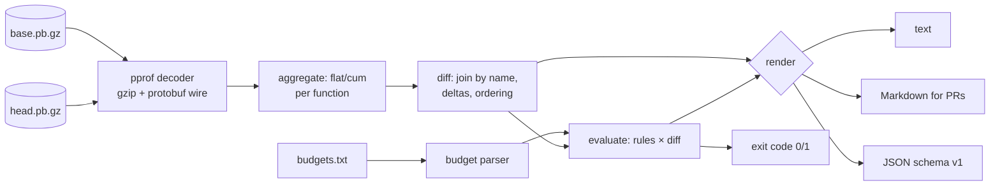

# profgate

[English](README.md) | [中文](README.zh.md) | [日本語](README.ja.md)

[](LICENSE) [](go.mod) [](CHANGELOG.md)  [](CONTRIBUTING.md)

**profgate：开源、零依赖的 CLI，对比两份 pprof profile，并在函数超出 CPU 或内存分配预算时让 CI 失败——无界面、带阈值、开箱即得可贴进 PR 的 Markdown。**


```bash
git clone https://github.com/JaydenCJ/profgate && cd profgate
go build -o profgate ./cmd/profgate    # single static binary, stdlib only
```

> 预发布：v0.1.0 尚未在任何包仓库打 tag；请按上述方式从源码构建（任意 Go ≥1.22）。

## 为什么选 profgate？

Go 团队其实早就在收集 pprof profile——`go test -cpuprofile`、`/debug/pprof` 快照、benchmark 产物——却往往等到事故之后才去看。中间环节的工具没有把闭环补上：`go tool pprof -diff_base` 是为交互式终端里的人设计的，没有阈值概念，而且永远以 0 退出，CI 拿不到任何可执行的信号；`benchstat` 比较的是 benchmark 耗时，说不出*哪个函数*回归、内存分配去了哪里；持续性能分析 SaaS 什么都能答，但要花真金白银，还得把 profile 传到别人机器上。profgate 就是缺失的那道闸门：一个无界面的二进制，用内置的 protobuf 解码器解析两份 pprof 文件（零依赖），按函数逐一对齐，执行团队随代码提交的预算文件——绝对上限、增长上限、占总量百分比、整体上限——然后以退出码 1 结束，并输出一份点名函数、数值和被违反规则的 Markdown 报告。

| | profgate | go tool pprof -diff_base | benchstat | 性能分析 SaaS |
|---|---|---|---|---|
| 无界面、面向 CI（退出码有意义） | ✅ | ❌ 交互式 | ✅ | ❌ 仪表盘 |
| 函数级预算（绝对值 + 增长） | ✅ | ❌ | ❌ | ⚠️ 仅告警 |
| 可直接贴进 PR 的 Markdown 报告 | ✅ | ❌ | ❌ | ❌ |
| 函数级归因（flat/cum） | ✅ | ✅ | ❌ 仅耗时 | ✅ |
| 支持堆 profile（字节预算） | ✅ | ✅ | ❌ | ✅ |
| 离线运行，profile 不离开 runner | ✅ | ✅ | ✅ | ❌ |
| 运行时依赖 | 0 | Go 工具链 | Go 工具链 | agent + 后端 |

<sub>依赖数核对于 2026-07-13：profgate 只 import Go 标准库——连 profile.proto 的 wire 解码都在仓库内，`go build` 除编译器外别无所需。</sub>

## 特性

- **真 pprof、零依赖** — 仓库内自带针对 profile.proto 的最小 protobuf wire 解码器：gzip 或裸流、packed 或非 packed 编码、跳过未知字段，损坏文件报出精确错误而不是 panic。
- **预算即代码** — 逐行书写的 `budgets.txt`，模式为锚定 glob：`max-flat`、`max-cum`、增长上限、`@total` 整体上限；数值可写 `25ms`、`4MiB`、`10%` 或裸计数，并按 profile 单位做校验。
- **能抓住真回归的增长语义** — 增长百分比相对 base 计算，全新出现的热点函数会击穿任何百分比上限；性能改进永不判失败；`max-flat-growth=0ns` 可封死任何一点上涨。
- **可贴进 PR 的 Markdown** — `--format markdown` 以裁决开头，先列违规表（函数、base→head、Δ、规则及其行号），再列变化最大者；可直接管道进 PR 评论或 job summary。
- **任意 sample type** — CPU 纳秒、`alloc_space` 字节、`alloc_objects` 计数，或 profile 里任何类型，经 `--sample-type` 指定；拿纳秒去比字节是硬错误，绝不产出垃圾 diff。
- **逐字节确定性** — 相同输入产出完全相同的报告，包括所有排序；给机器的稳定 JSON（`schema_version: 1`）。
- **CI 级退出码** — 0 通过、1 预算违规、2 参数/预算错误、3 profile 不可读——流水线能分清"回归"和"profgate 配错了"。

## 快速上手

```bash
# fabricate a demo base/head pair (or use your own pprof files)
go run ./examples/make-demo-profiles /tmp/demo
./profgate diff /tmp/demo/base.cpu.pb.gz /tmp/demo/head.cpu.pb.gz
```

真实抓取的输出：

```text
profgate diff — cpu/nanoseconds
base: /tmp/demo/base.cpu.pb.gz   head: /tmp/demo/head.cpu.pb.gz
total: 100ms → 134ms   Δ +34ms (+34.0%)

Δ FLAT               FLAT (BASE→HEAD)     Δ CUM                CUM (BASE→HEAD)      FUNCTION
+32ms (+320.0%)      10ms → 42ms          +32ms (+320.0%)      10ms → 42ms          demoapp/render.Table
+4ms (+10.0%)        40ms → 44ms          +4ms (+6.7%)         60ms → 64ms          demoapp/handlers.Index
-2ms (-6.7%)         30ms → 28ms          -2ms (-6.7%)         30ms → 28ms          demoapp/store.Query
0 (0.0%)             0 → 0                +34ms (+34.0%)       100ms → 134ms        demoapp/router.Serve
0 (0.0%)             0 → 0                +34ms (+34.0%)       100ms → 134ms        main.main
0 (0.0%)             0 → 0                +30ms (+75.0%)       40ms → 70ms          demoapp/handlers.Report
… 1 more function; use --top 0 --all to list every one
```

接着上闸——`./profgate check --budgets examples/budgets.txt /tmp/demo/base.cpu.pb.gz /tmp/demo/head.cpu.pb.gz`（真实输出，退出码 1）：

```text
profgate check — cpu/nanoseconds
total: 100ms → 134ms   Δ +34ms (+34.0%)
budget checks: 12   functions matched: 7

BREACH  @total                           total  100ms → 134ms, allowed Δ +20ms  exceeds max-growth=20% (budgets line 8)
BREACH  demoapp/render.Table             flat   10ms → 42ms, allowed 35ms  exceeds max-flat=35ms (budgets line 11)
BREACH  demoapp/render.Table             flat   10ms → 42ms, allowed Δ +5ms  exceeds max-flat-growth=50% (budgets line 11)
BREACH  demoapp/render.Table             flat   10ms → 42ms, allowed Δ +20ms  exceeds max-flat-growth=200% (budgets line 20)

check: FAIL (4 breaches)
```

同一次运行加 `--format markdown`，可直接渲染进 PR 评论（节选）：

```text
## profgate check — ❌ FAIL

| Function | Metric | Base | Head | Δ | Budget | Rule |
|---|---|---:|---:|---:|---|---|
| `demoapp/render.Table` | flat | 10ms | 42ms | **+32ms (+320.0%)** | `max-flat-growth=50%` | budgets line 11 |
```

## 预算

规则写在随代码提交的文本文件里（每行一个模式 + 若干限制），或用内联 `--budget` 传入——完整参考见 [docs/budgets.md](docs/budgets.md)，带注释示例见 [examples/budgets.txt](examples/budgets.txt)。

| 键 | 作用对象 | 违规条件 |
|---|---|---|
| `max-flat` / `max-cum` | 函数 glob | head 值超过限额 |
| `max-flat-growth` / `max-cum-growth` | 函数 glob | head − base 超过许可量 |
| `max` / `max-growth` | `@total` | profile 总量 / 其增长超过限额 |

数值：CPU profile 用时长（`250ns`…`1.5s`），堆 profile 用大小（`512B`、`4KiB`、`2MiB`），`%`（值限制相对 head 总量，增长限制相对 base），或裸计数。单位与 profile 不符属配置错误，退出码 2。

## CLI 参考

`profgate <diff|check|show|version> [flags] <profiles…>` — 退出码：0 通过、1 违规、2 用法/配置错误、3 运行时错误。

| 参数 | 默认值 | 效果 |
|---|---|---|
| `--format` | `text` | `text`、`markdown` 或 `json`（`show`：`text`/`json`） |
| `--sample-type` | profile 默认 | 如 `cpu`、`alloc_space`，或限定形式 `cpu/nanoseconds` |
| `--top` | 20（`check`：10） | 限制表格行数；`0` = 不限 |
| `--all` | 关 | 把数值没有变化的函数也列出来 |
| `--budgets`（check） | — | 预算文件路径 |
| `--budget`（check） | — | 内联规则 `'PATTERN key=value …'`，可重复 |

## 验证

本仓库不带任何 CI；以上每一条主张都由本地运行验证：

```bash
go test ./...            # 90 deterministic tests, offline, < 5 s
bash scripts/smoke.sh    # end-to-end CLI check, prints SMOKE OK
```

## 架构



## 路线图

- [x] v0.1.0 — 纯标准库 pprof 解码器、任意 sample type 的 flat/cum 对比、带增长语义的 glob 预算、text/Markdown/JSON 报告、`check` 退出码闸门、90 个测试 + smoke 脚本
- [ ] `--baseline-dir` 模式：从按日期存放的 profile 目录中选取最新基线
- [ ] 为违规函数标注源码行（`file.go:42`）
- [ ] 单次运行检查多份 profile（CPU + 堆一起把关）
- [ ] 可选噪声下限：忽略低于 N 个样本的差异，吸收采样抖动
- [ ] `profgate init`：按当前 profile 的热点函数生成预算文件骨架

完整列表见 [open issues](https://github.com/JaydenCJ/profgate/issues)。

## 参与贡献

欢迎 issue、讨论与 PR——本地流程（格式化、vet、测试、`SMOKE OK`）见 [CONTRIBUTING.md](CONTRIBUTING.md)。入门任务标注为 [good first issue](https://github.com/JaydenCJ/profgate/issues?q=is%3Aissue+is%3Aopen+label%3A%22good+first+issue%22)，设计讨论在 [Discussions](https://github.com/JaydenCJ/profgate/discussions)。

## 许可证

[MIT](LICENSE)
